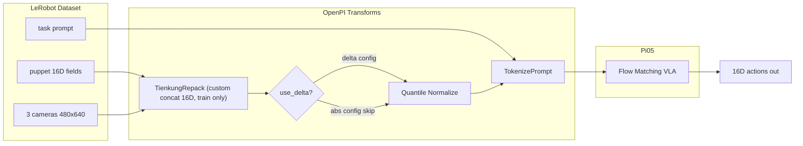

# π₀.₅ 微调方案 — 天工(TienKung)双臂 lint-roller 任务

> 目标：用 openpi 的 pi0.5 (pi05) 模型微调「用静电滚轮捡桌面碎屑」任务。
> 撰写日期：2026-07-02 | 最后更新：2026-07-02

## 〇、已确认决策（无需再选）

以下选项已敲定，后续实现按此执行：

| 项 | 决策 | 说明 |
|---|---|---|
| **state/action 来源** | **puppet** | 从臂真实执行位置；与部署闭环一致 |
| **action 表示** | **两套配置** | 主线 `delta`（关节 delta + 夹爪绝对），对照 `abs`（全绝对关节角） |
| **基座权重** | 本地 `checkpoints/pi05_base/params` | 已下载，无需再从 GCS 拉取 |
| **action_horizon** | 32 @ 29Hz | 约 1.1s，与 AR 管线 chunk=32 对齐 |
| **FPS** | 不下采样，保持 29Hz | 首版不做 2x 时间下采样 |
| **相机** | 三路全用 | top → base，left/right → wrist |
| **state 输入** | `discrete_state_input=False` | 连续 state，与 `pi05_libero` 一致 |
| **训练框架** | JAX 全量微调 | 单卡 H20Z 143GB；batch=32，30k steps，EMA=0.999，peak LR=2.5e-5 |

两套训练配置名（待实现）：

| 配置名 | action 模式 | 优先级 |
|---|---|---|
| `pi05_tienkung_lint_roller_delta` | 关节 delta + 夹爪绝对 | **主线，先训** |
| `pi05_tienkung_lint_roller_abs` | 全绝对关节角 | 对照实验 |

## 一、任务与数据集概况

**训练数据集路径**

```
/mnt/cpk/magic/openpi/datasets/tienkung_lint_roller_lerobot/
```

原始数据来源（未修改）：

```
/media/unify/lerobot_kai/tienkung_tabletop_soft_gripper_v2.1/tienkung_station_dualArm-gripper-3cameras_23/
  tienkung_station_dualArm-gripper-3cameras_23_use-a-lint-roller-to-pick-up-crumbs-on-the-desk_20260422_am/
    success/lerobot_RoboMIND/
```

| 项 | 值 |
|---|---|
| 格式 | 训练副本已修成 openpi 当前可加载的 LeRobot **v2.1** 元信息 |
| Episodes / 帧数 | 401 / 299,178（平均约 746 帧/条，约 25.7 秒） |
| FPS | 29 |
| 机器人 | 天工 station 双臂 + 软夹爪 + 3 相机 |
| 相机 | `camera_top` / `camera_left` / `camera_right`，各 640x480 RGB（Orbbec Gemini336L） |
| 语言指令 | "Use an electrostatic roller to pick up debris on the desktop"（已写入 `meta/tasks.jsonl`） |
| 采集时间 | 2026-04-22 |

**16 维 state/action 布局**（均来自 **puppet**，不含 head）

| 索引 | 含义 | 字段 |
|---|---|---|
| 0:7 | 左臂 7 关节（rad） | `puppet.arm_left_position_align.data` |
| 7:14 | 右臂 7 关节（rad） | `puppet.arm_right_position_align.data` |
| 14 | 左夹爪开度 | `puppet.end_effector_left_position_align.data` |
| 15 | 右夹爪开度 | `puppet.end_effector_right_position_align.data` |

训练时由 `PadStatesAndActions` 零填充到 `action_dim=32`；推理时 `TienkungOutputs` 截断回 16 维。

## 二、来自参考仓库 (UVA_dit-test-kswu) 的可复用经验

参考管线：`/mnt/xiaopeng/state_AR/UVA_dit-test-kswu`

1. **16 维**：左臂7 + 右臂7 + 左爪1 + 右爪1，不用 `head_position`。
2. **AR 管线用 master + 绝对角**；本方案改用 **puppet**（已确认），部署更稳。
3. **相机映射**：`camera_top` = 俯视主视角，`camera_left/right` = 左/右视角。
4. **action chunk = 32 步 @ 29Hz**；部署开环执行前 8~16 步、约 30Hz 下发。
5. **夹爪连续值**，部署 clip 到 [0, 1]。
6. AR 超参（LR=3e-6、100k steps）针对 DiT+VAE，**不照搬**到 pi05。

## 三、数据集兼容状态（已完成）

副本 `datasets/tienkung_lint_roller_lerobot/` 已从原始路径复制并修复元信息，原路径未动。

已修复内容：

- `meta/info.json` → `codebase_version = "v2.1"`，v2.1 路径模板
- `meta/episodes_stats.jsonl` → 统计量形状 squeeze（修复 `count` 维度错误）
- `meta/tasks.jsonl` → 自然语言 prompt
- 备份：`*.orig`

验证通过：

- `LeRobotDataset` 可加载：401 episodes，299178 frames
- `ds[0]` 三路图像 `[3, 480, 640]`，puppet/master 字段齐全
- 最终实测（2026-07-02）：`delta_timestamps` 下 4 个 puppet action key shape 为 `(32,7)/(32,7)/(32,)/(32,)`；三路视频解码为 float32 CHW `[0,1]`；`EpisodeAwareSampler(drop_n_last_frames=31)` 过滤后长度为 `286747 = 299178 - 401*31`

### 源码校验结论（2026-07-02 复核）

对照 openpi 源码逐条核对，方案已修正以下会导致失败/行为错误的点：

| 项 | 结论 | 依据 |
|---|---|---|
| `RepackTransform` 能否拼接字段 | **不能**，只重命名；16 维拼接改由自定义 `TienkungRepack` 完成 | [transforms.py:99](../src/openpi/transforms.py) |
| 动作序列如何生成 | `delta_timestamps` 作用于 `action_sequence_keys`；本数据集无 `actions` 列，必须把 4 个 puppet 字段列进去 | [data_loader.py:141](../src/openpi/training/data_loader.py)、[config.py:88](../src/openpi/training/config.py) |
| `repo_id` 用绝对路径 | **会出错**：norm stats 路径错位且 delta/abs 覆盖；改相对名 + `HF_LEROBOT_HOME` | [compute_norm_stats.py:111](../scripts/compute_norm_stats.py) |
| delta mask 布局 | `make_bool_mask(7,7,-1,-1)` 正确（对应 [左臂7,右臂7,左爪1,右爪1]） | [transforms.py:433](../src/openpi/transforms.py) |
| pi05 用 quantile norm | 正确，`use_quantile_norm = model_type != PI0` 自动开启 | [config.py:187](../src/openpi/training/config.py) |
| `repack` 是否推理时运行 | 否，仅训练；`data_transforms` 训练+推理都跑 | [config.py:293](../src/openpi/training/config.py) |
| 权重本地路径 | `CheckpointWeightLoader` 走 `maybe_download`，本地路径直接可用 | [weight_loaders.py](../src/openpi/training/weight_loaders.py) |
| action_horizon 可否≠base | 可，`pi05_libero` 就用 10；本方案用 32 | [config.py:744](../src/openpi/training/config.py) |
| episode 末尾 delta padding | LeRobot 会 clamp 到最后一帧并返回 `<key>_is_pad`；openpi 默认不使用该 mask | [lerobot_dataset.py](../.venv/lib/python3.11/site-packages/lerobot/common/datasets/lerobot_dataset.py) |
| 推理输出变换顺序 | `Unnormalize → AbsoluteActions → TienkungOutputs`，顺序正确（`Group.push` 把 outputs 加到开头）；`AbsoluteActions` 用的 state 已被 Unnormalize 还原 | [transforms.py:49](../src/openpi/transforms.py)、[policy_config.py:84](../src/openpi/policies/policy_config.py) |
| norm stats 随 checkpoint 保存 | 训练时自动写入 `checkpoint/<step>/assets/`；`serve_policy` 从 checkpoint 读取，推理机**不需要** `HF_LEROBOT_HOME` 或本地 assets | [checkpoints.py:71](../src/openpi/training/checkpoints.py)、[policy_config.py:59](../src/openpi/policies/policy_config.py) |
| 16 维统计 vs 32 维 padding | `Normalize` 在 Pad 之前作用于 16 维；推理端 `_unnormalize_quantile` 只反归一化前 16 维、其余透传 | [transforms.py:179](../src/openpi/transforms.py) |
| `DeltaActions` 推理行为 | obs 中无 `actions` key 时自动跳过，无需特判 | [transforms.py](../src/openpi/transforms.py) |
| prompt 注入时机 | `PromptFromLeRobotTask` 在 `create_torch_dataset` 内包装、在 repack 之前运行，`TienkungRepack` 可拿到 `prompt` | [data_loader.py:148](../src/openpi/training/data_loader.py) |
| 最终 checkpoint 步数 | 最后一次保存在 `num_train_steps - 1` = **29999**（非 30000）；中间仅保留 5000 倍数（`keep_period=5000`） | [train.py:272](../scripts/train.py) |

## 四、需要在 openpi 中新增的代码

> 本节已按源码校验修正。关键结论：**数据集里没有现成的 `state` / `actions` 列**，只有 4 个分散的 puppet 字段；而 [`RepackTransform`](../src/openpi/transforms.py) **只能重命名键、不能拼接**（其实现是 `jax.tree.map(lambda k: flat_item[k], structure)`）。因此 16 维的拼接必须由一个**自定义 transform** 完成，且动作序列要靠 `action_sequence_keys` + `delta_timestamps` 生成。

### 关键机制（校验后）

- 数据流水线顺序（见 [`data_loader.transform_dataset`](../src/openpi/training/data_loader.py)）：
  `repack_transforms` → `data_transforms.inputs`（含 `DeltaActions`）→ `Normalize` → `model_transforms`（`ResizeImages`/`TokenizePrompt`/`PadStatesAndActions`）。
- `repack_transforms` **只在训练时跑，推理不跑**；`data_transforms` 训练和推理都跑（所以 `TienkungInputs` 要能吃「推理时机器人直接发来的 key」）。
- 动作序列由 [`create_torch_dataset`](../src/openpi/training/data_loader.py) 用 `delta_timestamps` 对 `action_sequence_keys` 里的每个 key 取未来 `action_horizon` 帧堆叠而成。被堆叠的 key 变成 `[horizon, dim]`，其余 key 保持单帧 `[dim]`。
- 因 state 与 action 都来自同一批 puppet 字段，做法是：把 4 个 puppet 字段放进 `action_sequence_keys` → 堆叠成 `[horizon, dim]` → 自定义 transform 拼成 `[horizon, 16]` 作为 `actions`，并取 **第 0 帧** 作为当前 `state`（`delta_timestamps` 从 t=0 起，第 0 帧即当前帧）。
- `DeltaActions` 在 `Normalize` 之前、`PadStatesAndActions` 之前运行，作用于 16 维；delta 模式下 `actions[0]` 会变成 0（相对自身），与 ALOHA 行为一致。
- episode 末尾越界问题已实测：LeRobot 会把越界未来帧 clamp 到最后一帧，并返回 `<key>_is_pad`。本数据集 horizon=32 时，每条 episode 最后 31 帧受影响；401 条共 12,431 帧，占 4.16%。解决方案是训练采样时直接丢掉每条 episode 的最后 31 帧。

### 1. `src/openpi/policies/tienkung_policy.py`（新文件）

仿 [`libero_policy.py`](../src/openpi/policies/libero_policy.py)：

- **`TienkungInputs`**（训练+推理都跑）：输入是已重打包后的统一 key（`observation/state` 16 维、三路 `observation/images/*`、可选 `actions`、`prompt`）：
  - 图像：`camera_top → base_0_rgb`，`camera_left → left_wrist_0_rgb`，`camera_right → right_wrist_0_rgb`，三路 `image_mask` 均 True
  - **必须做图像解析**（照抄 [`libero_policy._parse_image`](../src/openpi/policies/libero_policy.py)）：训练时 LeRobot 解码视频得到 float32 CHW [0,1]，需转成 uint8 HWC；推理时机器人若直接发 uint8 HWC 则自动跳过转换
  - state 透传（后续 `PadStatesAndActions` 补零到 32）
  - 训练时透传 `actions`（16 维），透传 `prompt`
- **`TienkungOutputs`**：`actions[..., :16]`

### 2. `src/openpi/training/config.py` — `LeRobotTienkungDataConfig` + 自定义拼接 transform

需要新增一个 **训练期拼接 transform**（放进 `repack_transforms.inputs`，因此只在训练跑），把分散的 puppet 字段拼成推理同款 key：

```python
@dataclasses.dataclass(frozen=True)
class TienkungRepack(_transforms.DataTransformFn):
    """训练期：把堆叠后的 puppet 字段拼成 16 维 state/actions + 整理图像/prompt。"""
    def __call__(self, data: dict) -> dict:
        flat = _transforms.flatten_dict(data)
        # 4 个 puppet 字段经 delta_timestamps 后均为 [horizon, dim]；标量夹爪需 reshape 到 [...,1]
        def col(k):
            v = np.asarray(flat[k])
            return v[..., None] if v.ndim == 1 else v  # [horizon] -> [horizon,1]
        actions = np.concatenate([
            np.asarray(flat["puppet.arm_left_position_align.data"]),      # [h,7]
            np.asarray(flat["puppet.arm_right_position_align.data"]),     # [h,7]
            col("puppet.end_effector_left_position_align.data"),          # [h,1]
            col("puppet.end_effector_right_position_align.data"),         # [h,1]
        ], axis=-1)                                                        # [h,16]
        return {
            "observation/state": actions[0],                              # 当前帧 = 第 0 帧
            "observation/images/camera_top": flat["camera_observations.color_images.camera_top"],
            "observation/images/camera_left": flat["camera_observations.color_images.camera_left"],
            "observation/images/camera_right": flat["camera_observations.color_images.camera_right"],
            "actions": actions,                                           # [h,16]
            "prompt": flat["prompt"],
        }
```

`LeRobotTienkungDataConfig`，增加 `use_delta_joint_actions: bool` 开关，并**必须设置 `action_sequence_keys` 为 4 个 puppet 字段**。同时为了彻底解决 episode 末尾 padding，需要给 openpi 的 [`DataConfig`](../src/openpi/training/config.py) 增加一个通用字段：

```python
drop_n_last_frames: int = 0
```

并在 [`create_torch_dataset`](../src/openpi/training/data_loader.py) 创建 LeRobotDataset 后，用 LeRobot 自带的 `EpisodeAwareSampler(drop_n_last_frames=...)` 生成合法 index，再包成 `torch.utils.data.Subset`。这样 `compute_norm_stats` 与训练都会自动跳过末尾 padding 样本。

推荐实现：

```python
# data_loader.py
from lerobot.common.datasets.sampler import EpisodeAwareSampler

...
dataset = lerobot_dataset.LeRobotDataset(...)
if data_config.drop_n_last_frames:
    sampler = EpisodeAwareSampler(
        dataset.episode_data_index,
        drop_n_last_frames=data_config.drop_n_last_frames,
        shuffle=False,
    )
    dataset = torch.utils.data.Subset(dataset, list(sampler.indices))
```

TienKung config 中设为 `model_config.action_horizon - 1`，即 horizon=32 时丢掉每条 episode 最后 31 帧。

```python
@dataclasses.dataclass(frozen=True)
class LeRobotTienkungDataConfig(DataConfigFactory):
    use_delta_joint_actions: bool = True  # True=delta 主线, False=abs 对照

    def create(self, assets_dirs, model_config) -> DataConfig:
        repack = _transforms.Group(inputs=[TienkungRepack()])
        data_transforms = _transforms.Group(
            inputs=[tienkung_policy.TienkungInputs(model_type=model_config.model_type)],
            outputs=[tienkung_policy.TienkungOutputs()],
        )
        if self.use_delta_joint_actions:
            # 布局 [左臂7, 右臂7, 左爪1, 右爪1]，关节取 delta、夹爪保持绝对
            delta_action_mask = _transforms.make_bool_mask(7, 7, -1, -1)
            data_transforms = data_transforms.push(
                inputs=[_transforms.DeltaActions(delta_action_mask)],
                outputs=[_transforms.AbsoluteActions(delta_action_mask)],
            )
        model_transforms = ModelTransformFactory()(model_config)
        return dataclasses.replace(
            self.create_base_config(assets_dirs, model_config),
            repack_transforms=repack,
            data_transforms=data_transforms,
            model_transforms=model_transforms,
            drop_n_last_frames=model_config.action_horizon - 1,
            action_sequence_keys=(
                "puppet.arm_left_position_align.data",
                "puppet.arm_right_position_align.data",
                "puppet.end_effector_left_position_align.data",
                "puppet.end_effector_right_position_align.data",
            ),
        )
```

> 备选方案：也可以写一次性预处理脚本，把副本 parquet 增加 `observation.state`（16 维）与 `action`（16 维）两列并更新 `meta/info.json` 的 features，然后完全照 ALOHA 模式（`action_sequence_keys=("action",)`、标准 `RepackTransform`）。这样最贴近框架，但要重写 401 个 parquet；首版用上面的自定义 transform 更省事。

### 3. `_CONFIGS` 注册两套 TrainConfig

共用字段：`Pi0Config(pi05=True, action_dim=32, action_horizon=32, discrete_state_input=False)`

> 重要修正：`repo_id` **不能用绝对路径**。`compute_norm_stats.py` 的输出路径是 `config.assets_dirs / repo_id`（[compute_norm_stats.py:111](../scripts/compute_norm_stats.py)），若 `repo_id` 是绝对路径，pathlib 会丢弃 `assets_dirs/<config_name>` 前缀，导致 (a) norm stats 被写进数据集目录，(b) delta 与 abs 两套配置写到同一路径互相覆盖。应改用相对的 `repo_id` + `HF_LEROBOT_HOME`。openpi 的 `data_loader` 只把 `repo_id` 传给 `LeRobotDataset`（不传 `root`），本地数据集靠 `HF_LEROBOT_HOME` 定位。

```python
# 主线：delta
TrainConfig(
    name="pi05_tienkung_lint_roller_delta",
    model=pi0_config.Pi0Config(pi05=True, action_dim=32, action_horizon=32, discrete_state_input=False),
    data=LeRobotTienkungDataConfig(
        repo_id="tienkung_lint_roller_lerobot",   # 相对 id；配合 HF_LEROBOT_HOME=./datasets
        base_config=DataConfig(prompt_from_task=True),
        use_delta_joint_actions=True,
    ),
    weight_loader=weight_loaders.CheckpointWeightLoader(
        "./checkpoints/pi05_base/params"   # 本地已就绪，可用相对路径
    ),
    lr_schedule=_optimizer.CosineDecaySchedule(
        warmup_steps=1_000, peak_lr=2.5e-5, decay_steps=30_000, decay_lr=2.5e-6,
    ),
    optimizer=_optimizer.AdamW(clip_gradient_norm=1.0),
    ema_decay=0.999,
    num_train_steps=30_000,
    batch_size=32,
    num_workers=8,   # 默认 2 太小：batch=32 x 3 路相机 = 每 batch ~96 次视频帧解码，会成瓶颈
)

# 对照：absolute
TrainConfig(
    name="pi05_tienkung_lint_roller_abs",
    # ... 同上，仅 use_delta_joint_actions=False
)
```

因两套配置 `config_name` 不同，`assets_dirs`（`./assets/<config_name>`）也不同，norm stats 天然分开：`assets/pi05_tienkung_lint_roller_delta/tienkung_lint_roller_lerobot/` 与 `.../abs/...`。

## 五、超参（已确认）

| 项 | 值 | 说明 |
|---|---|---|
| 基座权重 | `checkpoints/pi05_base/params` | 本地已就绪 |
| peak LR | 2.5e-5 | cosine + warmup 1000 steps |
| batch size | 32 | 单卡 H20Z 全量微调 |
| 训练步数 | 30_000 | 每 1k 存、长期保留 5k 倍数 + 最终 29999；15k~30k 上真机对比 |
| num_workers | 8 | 默认 2 会被视频解码卡住（每 batch ~96 帧解码） |
| EMA | 0.999 | |
| action_horizon | 32 @ 29Hz | 部署开环前 8~16 步 |
| 归一化 | quantile（q01/q99） | `compute_norm_stats.py` 按配置各算一份 |
| 显存 | `XLA_PYTHON_CLIENT_MEM_FRACTION=0.9` | 训练前设置 |

与 AR 管线对照：

| 项 | AR 管线 | openpi pi05 |
|---|---|---|
| LR | 3e-6 | 2.5e-5 |
| 步数 | 100k | 30k |
| 有效 batch | 128（32 GPU） | 32（单卡） |
| state 历史 | 8 帧 tokens | 不支持（单帧 state） |

## 六、执行步骤清单

```bash
cd /mnt/cpk/magic/openpi && source .venv/bin/activate

# 关键：让 LeRobot 用相对 repo_id 从本地 datasets/ 找到数据集
export HF_LEROBOT_HOME=/mnt/cpk/magic/openpi/datasets

# 0. 数据集与 pi05_base 已就绪
#    datasets/tienkung_lint_roller_lerobot   (repo_id="tienkung_lint_roller_lerobot")
#    checkpoints/pi05_base/params

# 1. 实现代码（待做）
#    src/openpi/policies/tienkung_policy.py（TienkungInputs/Outputs）
#    src/openpi/training/config.py 中 TienkungRepack + LeRobotTienkungDataConfig + 两套 TrainConfig
#    src/openpi/training/data_loader.py 中新增 drop_n_last_frames / EpisodeAwareSampler 过滤

# 2. 计算归一化统计（delta / abs 各算一份，因 DeltaActions 在 norm 之前，两者动作分布不同）
uv run scripts/compute_norm_stats.py --config-name pi05_tienkung_lint_roller_delta
uv run scripts/compute_norm_stats.py --config-name pi05_tienkung_lint_roller_abs

# 3. 训练 — 主线 delta
XLA_PYTHON_CLIENT_MEM_FRACTION=0.9 uv run scripts/train.py pi05_tienkung_lint_roller_delta \
    --exp-name=lint_roller_delta_v1 --overwrite

# 4. 训练 — 对照 abs
XLA_PYTHON_CLIENT_MEM_FRACTION=0.9 uv run scripts/train.py pi05_tienkung_lint_roller_abs \
    --exp-name=lint_roller_abs_v1 --overwrite

# 5. 推理服务（以 delta 为例）
#    注意：最终 checkpoint 目录是 29999（train.py 在 num_train_steps-1 保存最后一次）；
#    中间保留 5000/10000/.../25000（keep_period=5000）。
#    norm stats 已随 checkpoint 保存在 <step>/assets/，推理机不需要 HF_LEROBOT_HOME。
uv run scripts/serve_policy.py policy:checkpoint \
    --policy.config=pi05_tienkung_lint_roller_delta \
    --policy.dir=checkpoints/pi05_tienkung_lint_roller_delta/lint_roller_delta_v1/29999

# 6. 机器人端 packages/openpi-client WebSocket 接入
#    发送 observation/state(16D) + 三路图像 + prompt；开环执行 chunk 前 8~16 步
```

> 提示：`compute_norm_stats.py` 遍历整个数据集（约 30 万帧 + 视频解码）会较慢，可先加 `--max-frames 20000` 快速验证流水线是否跑通，再全量计算。

## 七、风险与注意事项

1. **字段拼接必须自定义**：`RepackTransform` 不能拼接，务必用 `TienkungRepack`（见四.2）。标量夹爪字段堆叠后为 `[horizon]`，拼接前要 `expand_dims` 到 `[horizon,1]`，否则维度对不齐。
2. **`action_sequence_keys` 必须改**：默认是 `("actions",)`，本数据集没有该列，不改会直接报 KeyError；必须设成 4 个 puppet 字段。
3. **`repo_id` 用相对名 + `HF_LEROBOT_HOME`**：绝对路径会让 norm stats 写错位置且 delta/abs 互相覆盖（见四.3）。
4. **delta / abs 需各算一份 norm stats**：`DeltaActions` 在 `Normalize` 之前，两套动作分布不同；两配置 `config_name` 不同已自动分目录，但必须分别跑 `compute_norm_stats`。
5. **state = chunk 第 0 帧**：delta 模式下 `actions[0]` 归零属正常；推理时机器人须发送当前 16 维 state，输出经 `AbsoluteActions` 反变换后再下发。
6. **action chunk 边界已解决**：实测 LeRobot 会 clamp 到末帧并给 `<key>_is_pad`；本方案不使用 pad mask，而是在 dataset 层 `drop_n_last_frames=31`，直接不采样每条 episode 的最后 31 帧。
7. **图像格式解析不能省**：LeRobot 视频解码输出 float32 CHW [0,1]，`TienkungInputs` 里必须仿 `_parse_image` 转 uint8 HWC，否则 `ResizeImages`/模型输入会出错；推理时机器人直接发 uint8 HWC 即可（转换自动跳过）。
8. **过拟合**：401 条单任务，保留 15k / 20k / 25k / 29999 多个 checkpoint。
9. **相机语义**：left/right 可能是固定机位而非腕部相机；训练与部署视角 key 必须一致。
10. **不要用 pi05_droid / pi05_libero 作起点**；已用 `pi05_base`。
11. **左臂/左夹爪近似恒定（已实锤为 v1 loss 尖峰根因，已修复）**：全量数据扫描证实，delta 模式左臂 7 维 q99−q01≈1e-4，个别 episode 的左臂微动经 quantile 归一化被放大到 |normalized| 最高 **3259**（L_arm4, ep156），对应 v1 训练中 loss 周期性冲到 40~90 的尖峰（baseline 正常收敛≈0）。修复：新增 `scripts/patch_norm_stats.py`，对 q99−q01 < 0.01 的维度以中点为基准扩到 0.01（原文件备份 `.orig`）。patch 后全数据集 max|normalized| 从 3259 降到 18.8（左臂）/ 4.6（右臂）。**流程变更：compute_norm_stats → patch_norm_stats → train**。v1 checkpoint 推理端用旧 stats 反归一化会把左臂输出钉在原静止区间，部署是安全的，但建议用 patch 后的 stats 重训 v2。

## 八、数据流示意



## 九、参考文件索引

- openpi 样板：[`libero_policy.py`](../src/openpi/policies/libero_policy.py)、[`aloha_policy.py`](../src/openpi/policies/aloha_policy.py)、[`config.py`](../src/openpi/training/config.py)（`pi05_libero`、`LeRobotAlohaDataConfig`）
- 本地数据：`datasets/tienkung_lint_roller_lerobot/meta/info.json`
- 本地权重：`checkpoints/pi05_base/params`
- 参考仓库：`/mnt/xiaopeng/state_AR/UVA_dit-test-kswu`
  - `data/ur_lerobot_dataset.py`（字段拼接）
  - `realmachine_deploy_v2/tienkung/`（30Hz 下发、开环 8 步）
